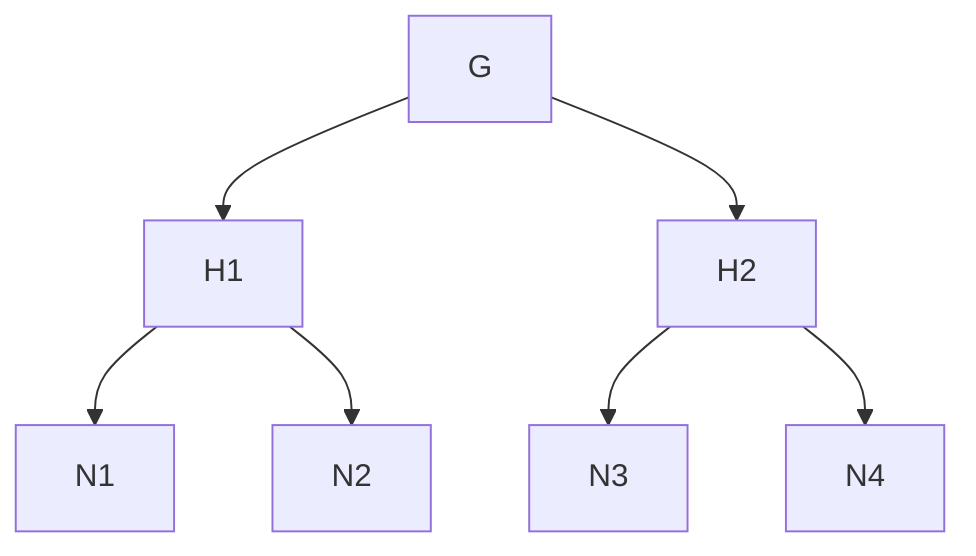

## Distributed Interior Point Method for Minimum Cost Flow Problem

A minimum cost flow algorithm using graph decomposition and the Interior Point Method.

## Overview of the approach

#### 1. Minimum Cost Flow Problem

The minimum cost flow problem is a linear programming problem that is used to find the minimum cost flow of a network.

The min-cost flow problem can be reformulated into a linear program in the following primal-dual form:

Primal:

$$
\min_{\bm{B}^{\mathsf{T}}\bm{f}=\bm{0}, \bm{l}≤\bm{f}≤\bm{u}} \bm{c}^{\mathsf{T}}\bm{f}
$$

Dual:

$$
\min_{\bm{By}+\bm{s}=\bm{c}} \sum \min (\bm{l_i, s_i, u_i, s_i})
$$

where $\bm{B} \in \mathbb{R}^{m \times n}$ is an edge-vertex incidence matrix of the graph, $\bm{f}$ is the flow and $\bm{s}$ is the slack.

#### 2. Interior Point Method

Our approach is to use the interior point method to solve the min-cost flow problem.

We define the edge weight matrix $\bm{W}$ and direction $\bm{v}$, then update $\bm{f}, \bm{s}$ by:

$$
\bm{f} \leftarrow \bm{f} + h\bm{W}^{1/2}\tilde{\bm{P}'}_w\bm{v}
$$

$$
\bm{s} \leftarrow \bm{s} + \alpha\bm{W}^{-1/2}\tilde{\bm{P}}_w\bm{v}
$$

for $O(\sqrt{m})$ times.

Intuitively, this is similar to the stochastic gradient descent method of neural networks.

#### 3. Graph Decomposition

Graph decomposition is a graph partitioning technique that partitions a graph into two edge-disjoint subgraphs.

For example, given a planar graph $G$,

it decomposes into two subgraphs $H_1, H_2$, which do not share any edge. Nodes that divides a graph is called a separator node, {4,8,12,16,20} here.

After several iterations of separating graphs, we obtain a separator tree with G as root and its decomposed graphs as child nodes.

#### 5. Cholesky Decomposition

Cholesky decomposition on a symmetric matrix L with blocks indexed by F and C.

$$
\mathbf{L} =
\begin{bmatrix}
\mathbf{I} & \mathbf{0} \\
\mathbf{L}_{C,F}\mathbf{(L_{F,F})^{-1}} & \mathbf{I}
\end{bmatrix}
\begin{bmatrix}
\mathbf{L}_{F,F} & \mathbf{0} \\
\mathbf{0} & \text{Sc}(\mathbf{L},C)
\end{bmatrix}
\begin{bmatrix}
\mathbf{I} & \mathbf{(L_{F,F})^{-1}L_{F,C}} \\
\mathbf{0} & \mathbf{I}
\end{bmatrix}.
$$

Using this technique, $\tilde{\bm{P}}_w$ can also be decomposed into its respective nodes. IPM can then be performed in a distributed manner using the property that the sum of $\tilde{\bm{P}}_w$ of the child nodes is equal to $\tilde{\bm{P}}_w$ of the parent nodes.

Finally, total runnign time is $O(n \cdot poly(log \ n))$.

## Reference

Sally Dong and Yu Gao and Gramoz Goranci and Yin Tat Lee and Richard Peng and Sushant Sachdeva and Guanghao Ye, "Nested Dissection Meets IPMs: Planar Min-Cost Flow in Nearly-Linear Time", 2022, arXiv:2205.01562, https://arxiv.org/abs/2205.01562
