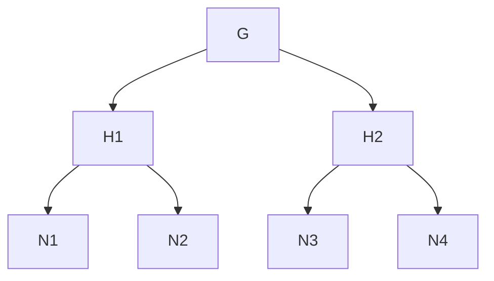

## Distributed Interior Point Method for Minimum Cost Flow Problem

A minimum cost flow algorithm using graph decomposition and the Interior Point Method.

## Overview of the approach

#### 1. Minimum Cost Flow Problem

The minimum cost flow problem is a linear programming problem that is used to find the minimum cost flow of a network.

The min-cost flow problem can be reformulated into a linear program in the following primal-dual form:

Primal:

$$
\min_{\mathit{B}^{\mathsf{T}}\mathrm{f}=\mathit{0}, \mathit{l}≤\mathit{f}≤\mathit{u}} \mathit{c}^{\mathsf{T}}\mathit{f}
$$

Dual:

$$
\min_{\mathit{By}+\mathit{s}=\mathit{c}} \sum \min (\mathit{l_i, s_i, u_i, s_i})
$$

where $\mathit{B} \in \mathbb{R}^{m \times n}$ is an edge-vertex incidence matrix of the graph, $\mathit{f}$ is the flow and $\mathit{s}$ is the slack.

#### 2. Interior Point Method

Our approach is to use the interior point method to solve the min-cost flow problem.

We define the edge weight matrix $\mathit{W}$ and direction $\mathit{v}$, then update $\mathit{f}, \mathit{s}$ by:

$$
\mathit{f} \leftarrow \mathit{f} + h\mathit{W}^{1/2}\tilde{\mathit{P}'}_w\mathit{v}
$$

$$
\mathit{s} \leftarrow \mathit{s} + \alpha\mathit{W}^{-1/2}\tilde{\mathit{P}}_w\mathit{v}
$$

for $O(\sqrt{m})$ times.

Intuitively, this is similar to the stochastic gradient descent method of neural networks.

#### 3. Graph Decomposition

Graph decomposition is a graph partitioning technique that partitions a graph into two edge-disjoint subgraphs.

For example, given a planar graph $G$,

it decomposes into two subgraphs $H_1, H_2$, which do not share any edge. Nodes that divides a graph is called a separator node, {4,8,12,16,20} here.

After several iterations of separating graphs, we obtain a separator tree with G as root and its decomposed graphs as child nodes.

#### 5. Cholesky Decomposition

Cholesky decomposition on a symmetric matrix $\mathit{L}$ which can construct $\tilde{\mathit{P}}_w$ with 3 blocks.

$$
\mathit{L} = \mathit{B}^{\mathsf{T}}\mathit{W}\mathit{B}
$$

Then the following relation holds for $\mathit{L}^{(G)}$ of a graph $G$ and $\mathit{L}^{(H_1)}, \mathit{L}^{(H_2)}$ for its decomposition graphs $H_1, H_2$:

$$
\mathit{L}^{(G)} = \mathit{L}^{(H_1)} + \mathit{L}^{(H_2)}
$$

Using this technique, IPM can then be performed in parallel.

Finally, total runnign time is $O(n \cdot poly(log \ n))$.

## Reference

Sally Dong and Yu Gao and Gramoz Goranci and Yin Tat Lee and Richard Peng and Sushant Sachdeva and Guanghao Ye, "Nested Dissection Meets IPMs: Planar Min-Cost Flow in Nearly-Linear Time", 2022, arXiv:2205.01562, https://arxiv.org/abs/2205.01562
