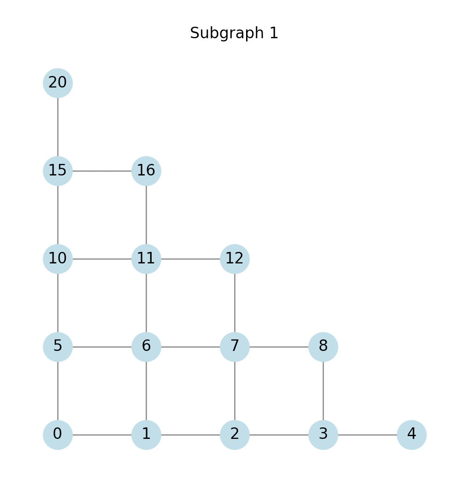

## Distributed Interior Point Method for Minimum Cost Flow Problem

A minimum cost flow algorithm using graph decomposition and the Interior Point Method.

## Theory

#### 1. Graph Decomposition

Graph decomposition is a graph partitioning technique that partitions a graph into two edge-disjoint subgraphs.

For example, given a planar graph G,


it decomposes into two subgraphs, which do not share any edge. Nodes that divides a graph is called a separator node, {4,8,12,16,20} here.




#### 2. Separator Tree

A separator tree is an iterated tree with G as the root and its decomposed graph as the nodes.

```
Separator: [20, 16, 12, 8, 4]
Left:
  Separator: [15, 11, 7, 3]
  Left:
    Separator: [10, 6, 2]
    Left:
    Right:
      Separator: [6]
      Left:
        Separator: [7, 3]
      Right:
        Separator: [15, 11]
  Right:
    Separator: [12]
    Left:
      Separator: [8, 4]
      Left:
        Separator: [3]
      Right:
        Separator: [7]
    Right:
      Separator: [11, 15]
Right:
  Separator: [12, 18, 24]
  Left:
    Separator: [13, 19]
    Left:
      Separator: [9, 13]
      Left:
      Right:
        Separator: [13, 9]
    Right:
      Separator: [13, 19]
  Right:
    Separator: [16, 22, 18]
    Left:
    Right:
      Separator: [20, 22]
```

#### 3. Cholesky Decomposition

Cholesky decomposition on a symmetric matrix L with blocks indexed by F and C.
Using this technique, the objective function can be decomposed into its respective subgraphs, and optimization can be performed on each subgraph in parallel.

#### 4. Interior Point Method

The interior point method is an optimization technique that determines the direction in which the objective function is to be updated and repeats constant updates in that direction. The direction of update is determined by the error between the current solution and the optimal solution.

This is similar to the stochastic gradient descent method of neural networks.

## Reference

Sally Dong and Yu Gao and Gramoz Goranci and Yin Tat Lee and Richard Peng and Sushant Sachdeva and Guanghao Ye, "Nested Dissection Meets IPMs: Planar Min-Cost Flow in Nearly-Linear Time", 2022, arXiv:2205.01562, https://arxiv.org/abs/2205.01562
